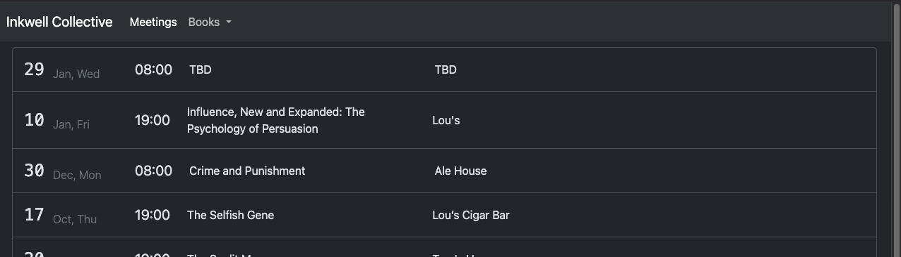
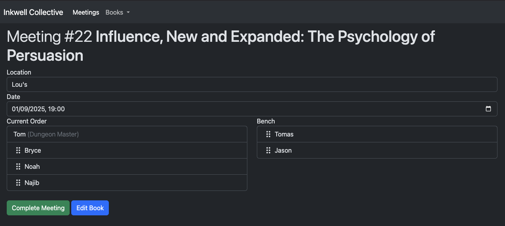
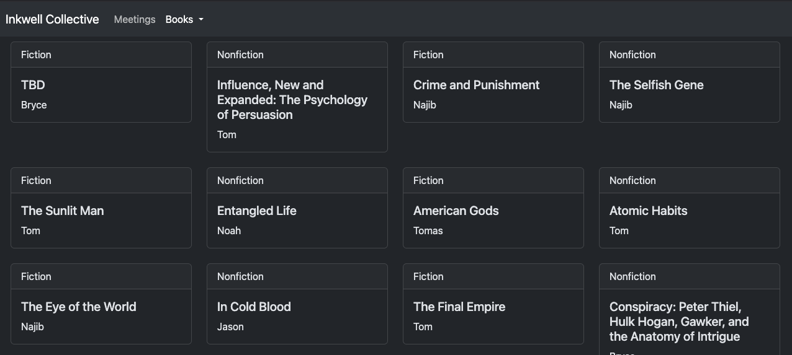

# Bookclub Management Made Easy

## Overview

Bookclub is a Loco.rs application designed to help you manage your book club.

It allows you to manage meetings, attendance, books, and more, in the simplest way possible.

Screenshots

### View your meetings

### Track attendance and ordering

### View all of your books

## Development

This repo uses [`devenv`](https://devenv.sh/) for local development.
To get started, install `devenv`, then run `devenv up` in the root of this repo.
Once running, the server will reload when any relevant file changes.
This repo uses [`watchexec`](https://github.com/watchexec/watchexec) to rebuild the server.

To access a shell with all proper binaries installed, run `devenv shell`.
